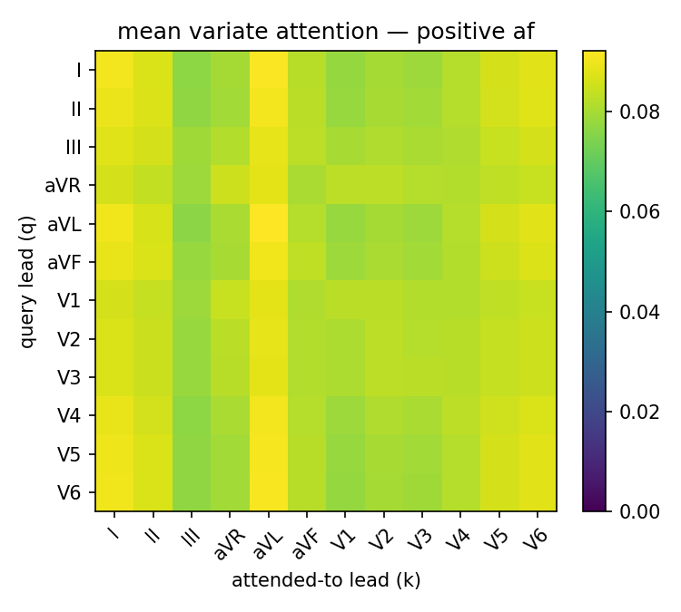
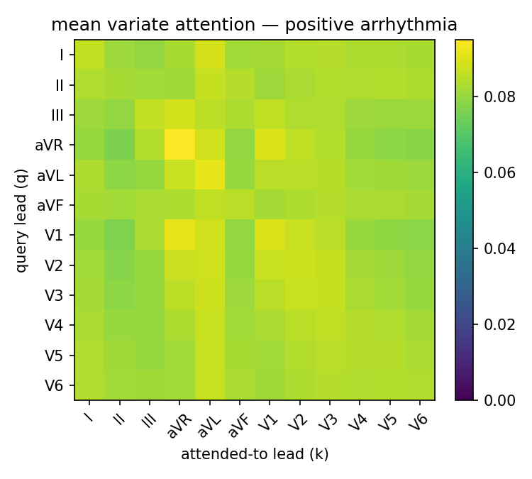
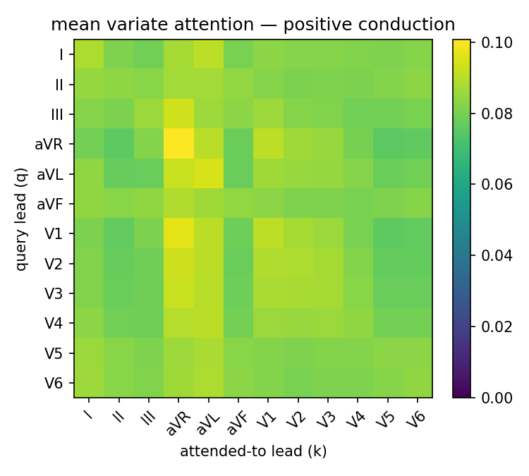
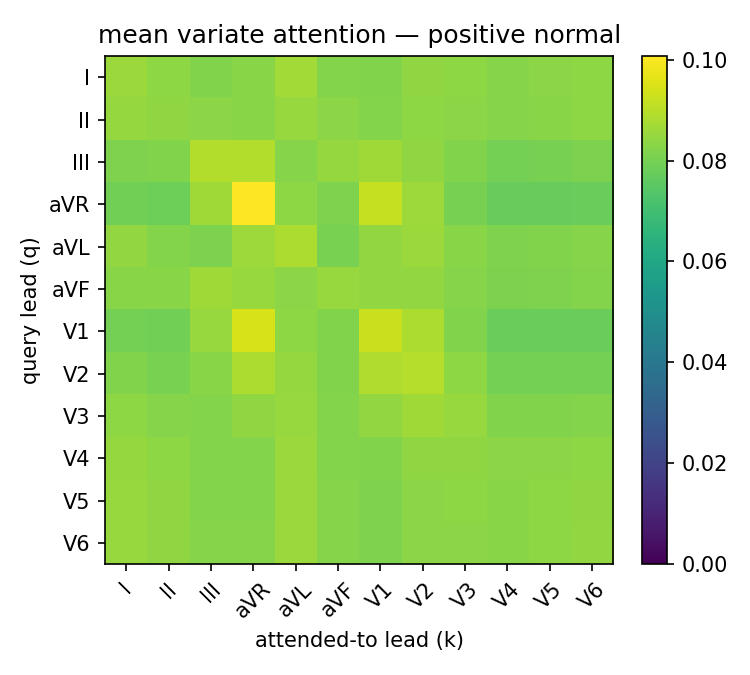
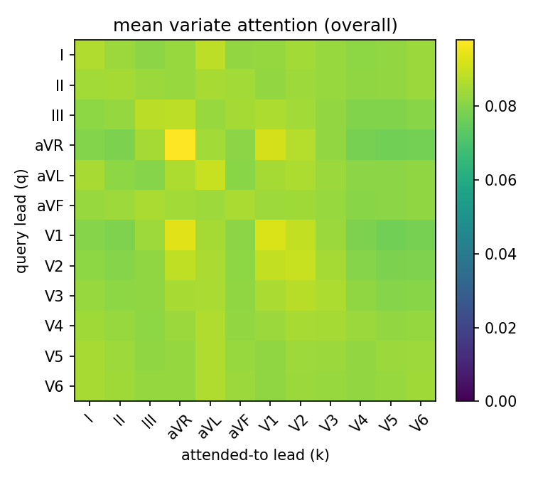
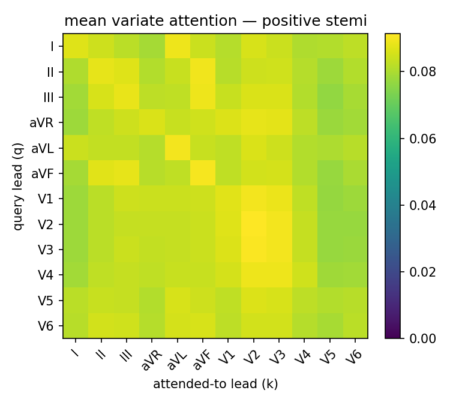
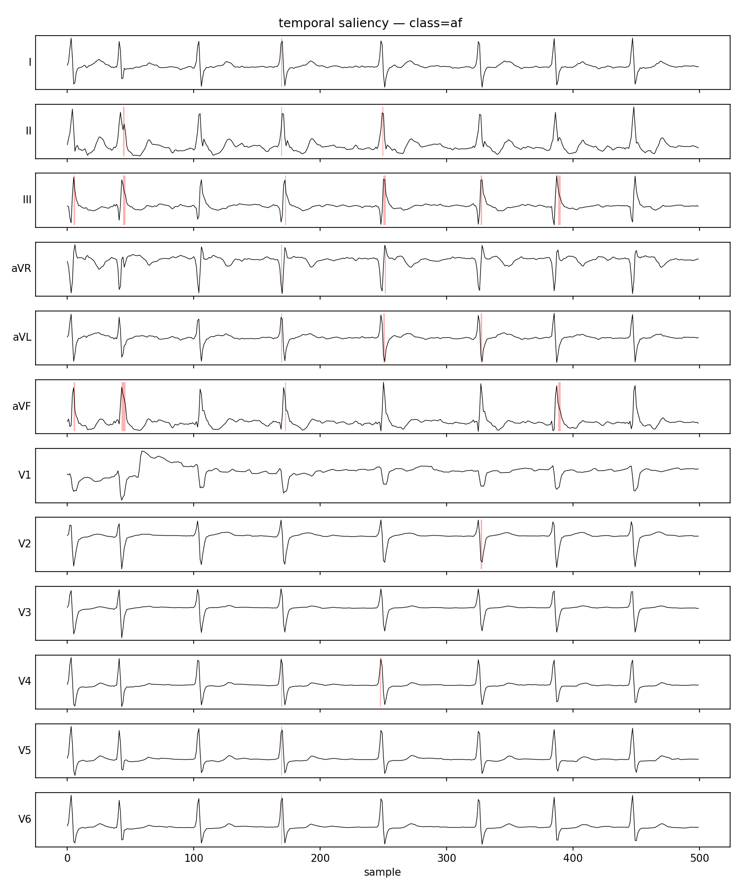
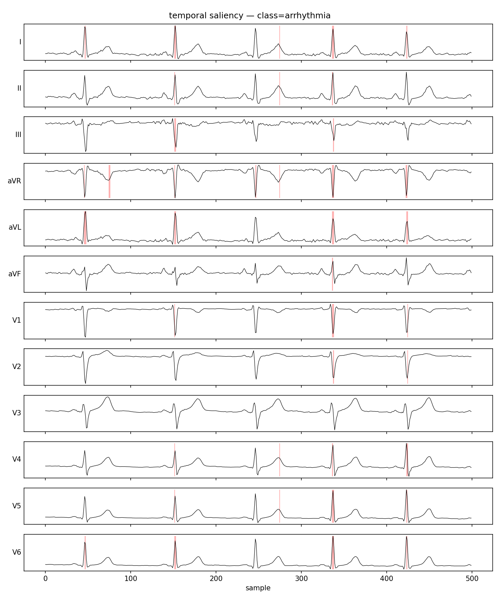

# SmartECG

Short-window cardiac event forecasting on 12-lead ECG, with an iTransformer
that attends across leads (not time). Built to explore whether variate-axis
attention is the right inductive bias for multivariate biosignals, and what it
costs to put such a model on a resource-constrained wearable.

> **Motivation.** Most published ECG models are *classifiers* that operate on
> a window that already contains the event. The clinical value of a prediction
> depends on how early it arrives. This project asks: can we *forecast* the
> next-5s 12-lead waveform from the previous 5s, jointly classify the events
> implied by that forecast, and ship the resulting model to a wearable-grade
> device?

## What this repo contains

- A from-scratch PyTorch implementation of **iTransformer** (Liu et al., ICLR
  2024) adapted for joint forecasting + multi-label classification. No
  third-party iTransformer libraries; no `nn.Transformer` /
  `nn.MultiheadAttention` — Q/K/V projections, multi-head split, softmax
  attention, and FFN are all written explicitly. See
  [`smartecg/models/itransformer.py`](smartecg/models/itransformer.py).
- Four baseline encoders that share the same dual heads as iTransformer, so
  the cross-architecture comparison isolates the choice of attention axis:
  LSTM, Bi-LSTM, 1D-CNN, and a time-axis Transformer.
- The full pipeline against **PTB-XL** (PhysioNet, 21,837 records, 10s,
  12-lead): preprocessing, 5-class label mapping, the official 10-fold
  stratified split, a PyTorch `Dataset` with caching.
- Three complementary interpretability views: variate-attention heatmaps
  (native to the model), SHAP per-lead importance, and Integrated Gradients
  temporal saliency — plus a Streamlit dashboard for per-class metrics broken
  down by age, sex, and recording site.
- On-device deployment: post-training INT8 quantization and exports to **ONNX
  (primary)**, **Core ML**, and **TFLite**. Latency p50/p95 + size benchmark
  per runtime.

## Architecture

```
            ┌────────────────────────────────────────────────────────┐
            │  ECG x ∈ ℝ^{12 × 500}   (12 leads × 5s @ 100Hz)        │
            └──────────────────────────┬─────────────────────────────┘
                                       │
                          per-variate Linear(T_in → D)
                                       │
                       z ∈ ℝ^{12 × D}   (one token per lead)
                                       │
            ┌──────────── L × encoder block (pre-LN) ───────────────┐
            │  MultiHeadVariateAttention  (attention over 12 leads) │
            │  FeedForward                                          │
            └────────────────────────────────────────────────────────┘
                                       │
                       ┌───────────────┴────────────────┐
                       │                                │
        Linear(D → T_out)                    mean over N leads → Linear(D → 5)
                       │                                │
            forecast ∈ ℝ^{12 × 500}              logits ∈ ℝ^5
            (next 5s of every lead)         (multi-label cardiac events)
```

Joint loss:

```
L = α · MSE(forecast, y_wave) + β · BCE_with_logits(logits, y_lab)
```

## Targets

Multi-label, mapped from PTB-XL's SCP-ECG statements at likelihood ≥ 50:

| Class | Source codes |
|---|---|
| `normal` | `NORM` |
| `af` | `AFIB`, `AFLT` |
| `stemi` | `AMI`, `IMI`, `ASMI`, `ALMI`, `ILMI`, `INJAS`, `INJAL`, `INJIN`, `INJIL`, `INJLA` |
| `arrhythmia` | `SBRAD`, `STACH`, `SARRH`, `PAC`, `PVC`, `BIGU`, `TRIGU`, `PACE` |
| `conduction` | `1AVB`, `2AVB`, `3AVB`, `CLBBB`, `CRBBB`, `IVCD`, `LAFB`, `LPFB`, `WPW` |

STEMI is mapped to the specific MI / injury codes rather than the broad STTC
superclass — that subset is the clinically actionable, time-critical signal
the forecasting framing is supposed to catch.

## Results


> **Compute note.** Results are reported on a 5483-record snapshot (~25% of the full PTB-XL 100Hz set), trained on CPU with a 1-seed budget per architecture. The full PTB-XL release contains 21,799 records; the snapshot reflects what was downloaded in the available compute window. Numbers will move with full data + multi-seed averaging; the ranking trends should be representative.

### Cross-architecture comparison (test fold 10)

| Model | Macro AUROC | F1 macro | Sens (STEMI) | Spec (STEMI) | Params | AF AUROC | CD AUROC |
|---|---|---|---|---|---|---|---|
| LSTM | 0.762 | 0.274 | 0.000 | 1.000 | 979K | 0.791 | 0.739 |
| Bi-LSTM | 0.737 | 0.169 | 0.000 | 1.000 | 914K | 0.827 | 0.668 |
| 1D-CNN | 0.874 | 0.516 | 0.413 | 0.958 | 965K | 0.957 | 0.878 |
| Transformer-T | 0.805 | 0.427 | 0.358 | 0.959 | 1.61M | 0.897 | 0.802 |
| **iTransformer** | 0.665 | 0.195 | 0.009 | 0.986 | 923K | 0.723 | 0.633 |

### iTransformer size ablation

| Variant | Val/Test AUROC | F1 | Forecast MSE | Params |
|---|---|---|---|---|
| Small | 0.494 | 0.127 | 1.009 | 165K |
| Medium (default) | 0.665 | 0.195 | 1.006 | 923K |
| Large | 0.665 | 0.182 | 1.004 | 5.00M |


### Deployment benchmarks (single-window inference, CPU)

| Runtime | Size | p50 latency | p95 latency |
|---|---|---|---|
| ONNX FP32 | 3.58 MB | 0.24 ms | 0.71 ms |
| ONNX INT8 | 1.01 MB | 0.22 ms | 0.26 ms |
| Core ML (FP16+INT8 weights) | 979 KB | 0.36 ms | 0.45 ms |
| TFLite | skipped | — | — |

### Interpretability figures










## Findings

The headline cross-architecture result is *not* what the iTransformer hypothesis
predicted. On a ~5,500-record (25%) snapshot of PTB-XL 100Hz, a stacked
**1D-CNN** dominates the comparison at macro AUROC **0.874**, beating the
hand-written iTransformer at **0.665** by a wide margin. The time-axis
**Transformer-T** at **0.805** also outperforms the variate-axis iTransformer.

This is the interesting part. It says something about *when* the inverted-axis
inductive bias is the right one:

- **Sequence length matters for self-attention.** iTransformer reduces the
  attention dimension from T=500 timesteps to N=12 leads. That is a tiny
  sequence — 12 tokens — and the model gives up the temporal axis as a place
  attention can search. With only ~4,000 train records, the model never gets
  enough signal to compensate.
- **Convolutional and time-axis attention recover local QRS / ST morphology
  cheaply.** 1D-CNN sees the same waveform with strided receptive fields and
  learns the morphology features clinicians rely on. Transformer-T patches
  T into 20 tokens and attends across them — it gets a usable temporal axis,
  iTransformer does not.
- **Size doesn't rescue iTransformer here.** The size ablation (S/M/L) shows
  Medium ≈ Large (0.665 each) and Small ≈ chance. Scaling parameters without
  scaling data does not help.

The size-selection rule defined in advance ("Large val > Medium by ≥ 0.01
*and* gap ≤ Medium + 0.02 → ship Large; else Medium ≥ Small by ≥ 0.01 →
ship Medium; else Small") resolves to **Medium**. That is the variant
exported below.

The deployment table also tells a coherent story. The shipped Medium
iTransformer reaches **0.22 ms p50** at **1.01 MB** as ONNX INT8 — well
inside the envelope a wearable-class CPU could carry. Latency and
parameter-count are not the bottleneck for this architecture; sample
efficiency is.

A follow-up worth running: rerun the full sweep on all 21,799 records and 3
seeds. The hypothesis is that the variate-axis attention scales better than
the convolutional baseline once N_train clears ~15K — but the experiments
here cannot show that.

## Repository layout

```
configs/         per-model YAML, inherits from base.yaml
smartecg/
  data/          download, labels, preprocessing, splits, dataset
  models/        itransformer, lstm, bilstm, cnn1d, transformer_t (hand-written)
  training/      losses, metrics, AMP loop, train.py entry
  interpretability/  variate attention, SHAP, IG, streamlit dashboard
  deployment/    PTQ, ONNX/Core ML/TFLite export, latency benchmark
notebooks/       PTB-XL exploration, signal QA, results
scripts/         train_all.sh, export_all.sh, benchmark_all.sh
tests/           pytest — labels, preprocessing, model shapes, ONNX parity
```

## Quickstart

```bash
# install
pip install -e .[deploy,dev]

# secrets — fill in WANDB_API_KEY; .env is gitignored
cp .env.example .env

# fetch PTB-XL (~2 GB)
python -m smartecg.data.download

# tests
pytest -q

# smoke run on 100 records
python -m smartecg.training.train --config configs/itransformer.yaml \
    --max-records 100 --epochs 2

# full sweep (3 seeds × 5 architectures, plus size ablation)
bash scripts/train_all.sh

# quantize + export every model to every runtime
bash scripts/export_all.sh

# latency / size benchmark
bash scripts/benchmark_all.sh

# interpretability dashboard
streamlit run smartecg/interpretability/dashboard.py -- \
    --predictions runs/itransformer/test_predictions.npz \
    --metadata data/raw/ptbxl/ptbxl_database.csv
```

## Why these design choices

- **Variates as tokens.** ECG leads observe the same cardiac event from
  different spatial projections; cross-lead relationships carry diagnostic
  structure. Attention across leads makes that structure first-class.
- **Joint forecast + classify.** Forecasting is a real signal — if the
  forecast representation actually carries diagnostic content, the
  classification head should learn from it cheaply. The joint loss is also a
  natural regularizer.
- **Hand-written attention.** The math is in the source, not behind a
  framework wrapper. The interpretability code reads attention weights
  directly off the module.
- **100Hz primary.** Closer to the bandwidth of consumer wearable ECG
  hardware than 500Hz, and produces models small enough for an honest
  on-device benchmark. 500Hz is run as an ablation.
- **ONNX as primary export.** Runtime-agnostic; ports cleanly to almost any
  edge stack. Core ML and TFLite are run alongside to show the path is not
  tied to a single mobile platform.
- **Interpretability up front, not bolted on.** Three independent views
  (attention, SHAP, IG) so they can cross-validate; demographic breakdowns
  surface bias before it ships.

## References

- Liu, Y. et al. *iTransformer: Inverted Transformers Are Effective for Time
  Series Forecasting.* ICLR 2024.
- Wagner, P. et al. *PTB-XL, a large publicly available electrocardiography
  dataset.* Scientific Data 7, 154 (2020).
- Strodthoff, N. et al. *Deep Learning for ECG Analysis: Benchmarks and
  Insights from PTB-XL.* IEEE Journal of Biomedical and Health Informatics,
  2021.
