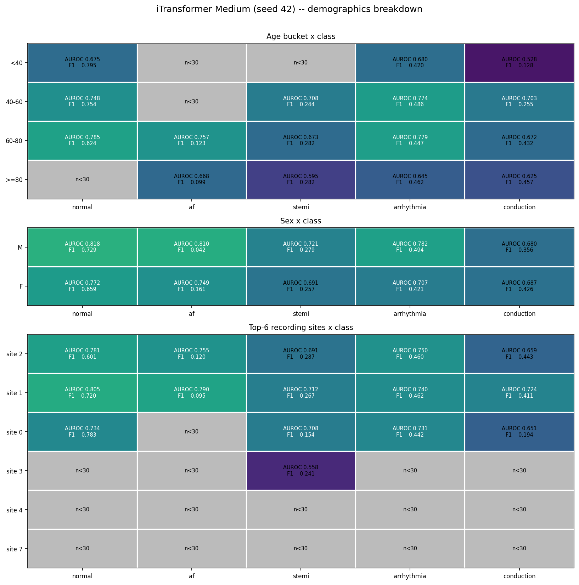
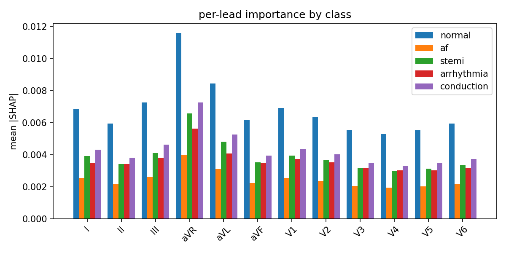
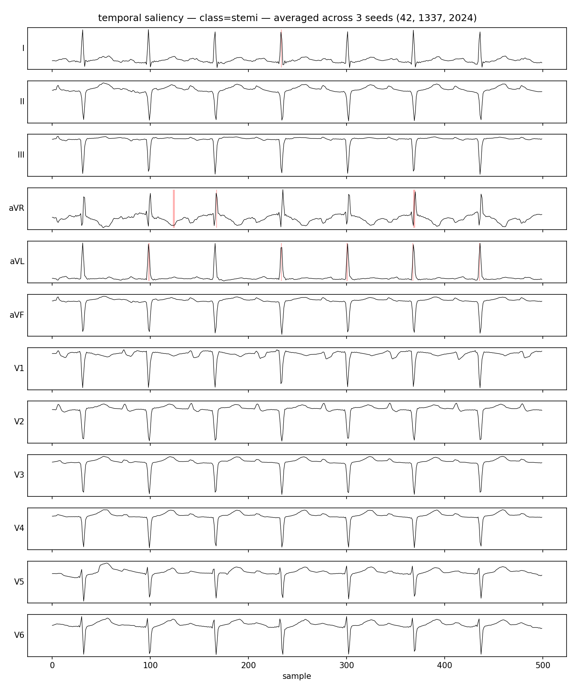
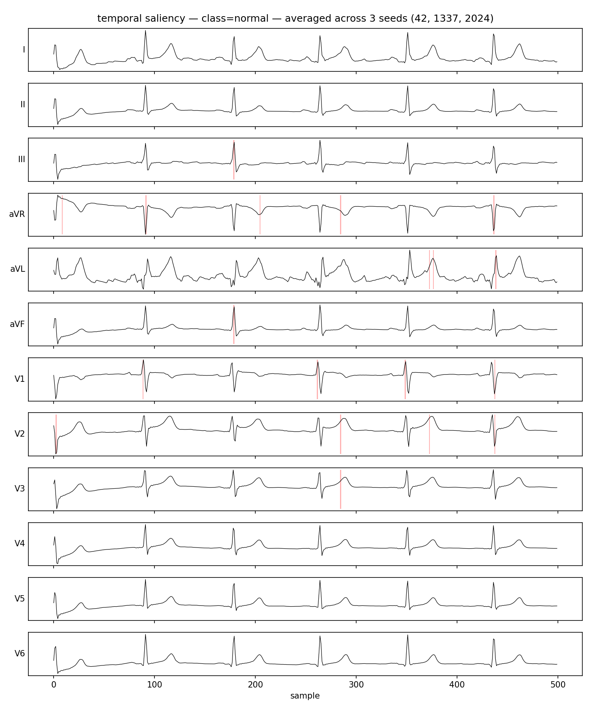
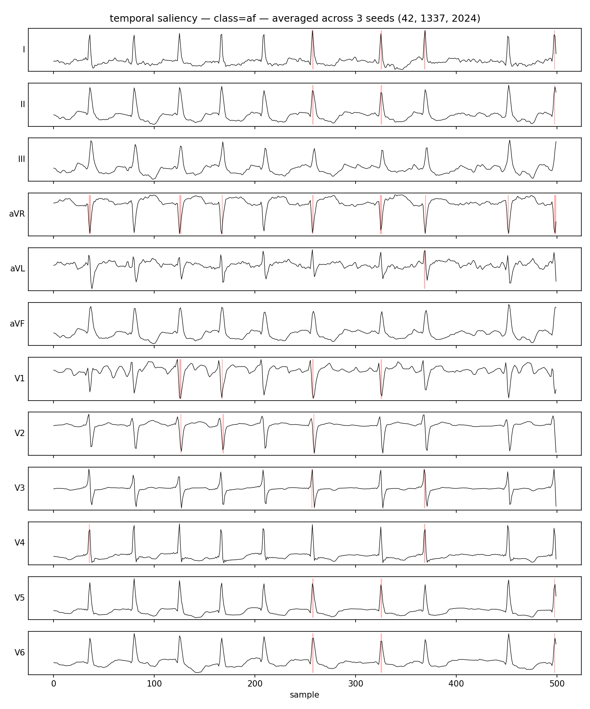
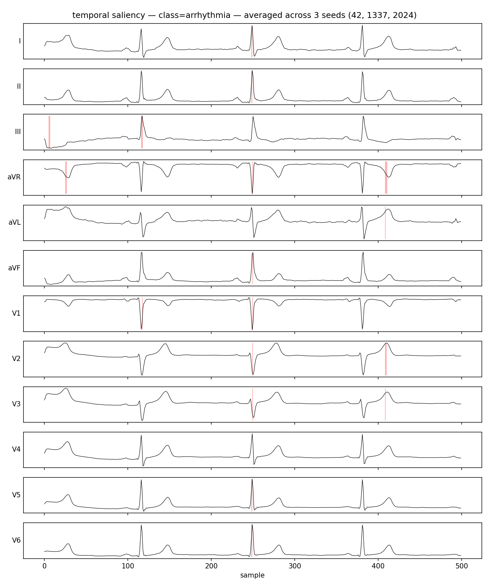
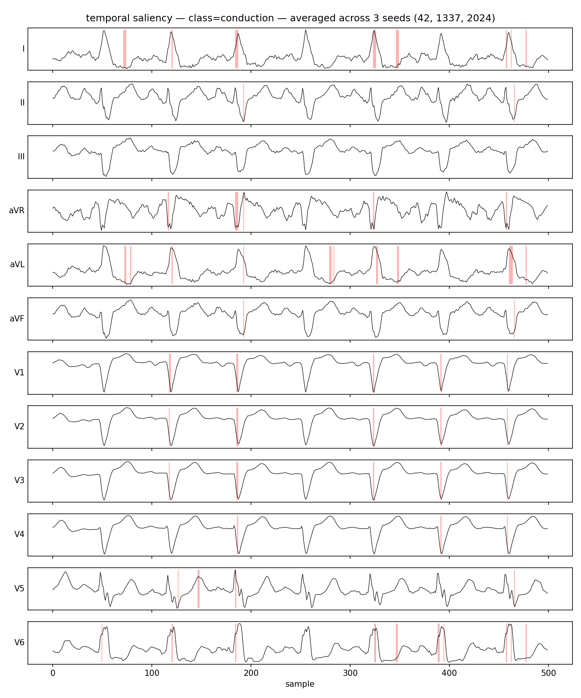

# SmartECG

Short-window cardiac event forecasting on 12-lead ECG, with an iTransformer
that attends across leads (not time). Built to explore whether variate-axis
attention is the right inductive bias for multivariate biosignals, and what it
costs to put such a model on a resource-constrained wearable.

> **Motivation.** Most published ECG models are *classifiers* that operate on
> a window that already contains the event. The clinical value of a prediction
> depends on how early it arrives. This project asks: can we *forecast* the
> next-5s 12-lead waveform from the previous 5s, jointly classify the events
> implied by that forecast, and ship the resulting model to a wearable-grade
> device?

## What this repo contains

- A from-scratch PyTorch implementation of **iTransformer** (Liu et al., ICLR
  2024) adapted for joint forecasting + multi-label classification. No
  third-party iTransformer libraries; no `nn.Transformer` /
  `nn.MultiheadAttention` — Q/K/V projections, multi-head split, softmax
  attention, and FFN are all written explicitly. See
  [`smartecg/models/itransformer.py`](smartecg/models/itransformer.py).
- Four baseline encoders that share the same dual heads as iTransformer, so
  the cross-architecture comparison isolates the choice of attention axis:
  LSTM, Bi-LSTM, 1D-CNN, and a time-axis Transformer.
- The full pipeline against **PTB-XL** (PhysioNet, 21,837 records, 10s,
  12-lead): preprocessing, 5-class label mapping, the official 10-fold
  stratified split, a PyTorch `Dataset` with caching.
- Three complementary interpretability views: variate-attention heatmaps
  (native to the model), SHAP per-lead importance, and Integrated Gradients
  temporal saliency — plus a Streamlit dashboard for per-class metrics broken
  down by age, sex, and recording site.
- On-device deployment: post-training INT8 quantization and exports to **ONNX
  (primary)**, **Core ML**, and **TFLite**. Latency p50/p95 + size benchmark
  per runtime.

## Architecture

```
            ┌────────────────────────────────────────────────────────┐
            │  ECG x ∈ ℝ^{12 × 500}   (12 leads × 5s @ 100Hz)        │
            └──────────────────────────┬─────────────────────────────┘
                                       │
                          per-variate Linear(T_in → D)
                                       │
                       z ∈ ℝ^{12 × D}   (one token per lead)
                                       │
            ┌──────────── L × encoder block (pre-LN) ───────────────┐
            │  MultiHeadVariateAttention  (attention over 12 leads) │
            │  FeedForward                                          │
            └────────────────────────────────────────────────────────┘
                                       │
                       ┌───────────────┴────────────────┐
                       │                                │
        Linear(D → T_out)                    mean over N leads → Linear(D → 5)
                       │                                │
            forecast ∈ ℝ^{12 × 500}              logits ∈ ℝ^5
            (next 5s of every lead)         (multi-label cardiac events)
```

Joint loss:

```
L = α · MSE(forecast, y_wave) + β · BCE_with_logits(logits, y_lab)
```

The default α, β are **0.05 / 2.0**.

## Targets

Multi-label, mapped from PTB-XL's SCP-ECG statements at likelihood ≥ 50:

| Class | Source codes |
|---|---|
| `normal` | `NORM` |
| `af` | `AFIB`, `AFLT` |
| `stemi` | `AMI`, `IMI`, `ASMI`, `ALMI`, `ILMI`, `INJAS`, `INJAL`, `INJIN`, `INJIL`, `INJLA` |
| `arrhythmia` | `SBRAD`, `STACH`, `SARRH`, `PAC`, `PVC`, `BIGU`, `TRIGU`, `PACE` |
| `conduction` | `1AVB`, `2AVB`, `3AVB`, `CLBBB`, `CRBBB`, `IVCD`, `LAFB`, `LPFB`, `WPW` |

STEMI is mapped to the specific MI / injury codes rather than the broad STTC
superclass — that subset is the clinically actionable, time-critical signal
the forecasting framing is supposed to catch.

One record in PTB-XL `records100/` has lead V5 entirely zero in the raw
source (`ecg_id 12722`); the model sees those samples as zeros.

## Results

Full PTB-XL @ 100 Hz, joint loss α=0.05 / β=2.0, fold 10 test, 3 seeds
(42, 1337, 2024). Cells below come from `runs/*/seeds.json` (mean ± std
across seeds). Deployment columns are populated for the shipping iTransformer
Medium only — the four baselines were not re-exported across runtimes.

### Cross-architecture comparison

| Architecture | Macro AUROC | F1 (macro) | STEMI sens | STEMI spec | AF AUROC | CD AUROC | Params |
|---|---|---|---|---|---|---|---|
| **iTransformer (M, ship)** | 0.748 ± 0.007 | 0.361 ± 0.022 | 0.169 ± 0.067 | 0.935 ± 0.040 | 0.779 ± 0.010 | 0.687 ± 0.008 | 922,617 |
| 1D-CNN | 0.918 ± 0.001 | 0.724 ± 0.004 | 0.573 ± 0.006 | 0.962 ± 0.004 | 0.970 ± 0.003 | 0.921 ± 0.001 | 964,757 |
| Transformer-T | 0.878 ± 0.002 | 0.620 ± 0.016 | 0.526 ± 0.040 | 0.943 ± 0.019 | 0.938 ± 0.002 | 0.883 ± 0.005 | 1,606,517 |
| Bi-LSTM | 0.877 ± 0.016 | 0.552 ± 0.044 | 0.529 ± 0.028 | 0.952 ± 0.003 | 0.935 ± 0.027 | 0.884 ± 0.010 | 913,909 |
| LSTM | 0.807 ± 0.007 | 0.396 ± 0.008 | 0.440 ± 0.022 | 0.942 ± 0.004 | 0.797 ± 0.013 | 0.830 ± 0.020 | 979,445 |

Live runs: https://wandb.ai/devdesai444/smartecg-v1

Filter the workspace for `itransformer_s42` (group `smartecg-v1-fullsweep`) for a representative iTransformer Medium training curve.

### iTransformer size ablation

| Variant | Params | Macro AUROC |
|---|---|---|
| Small | 164,985 | 0.7338 ± 0.0051 |
| **Medium (ship)** | 922,617 | **0.7484 ± 0.0065** |
| Large | 4,997,113 | 0.7579 ± 0.0036 |

Selection rule (locked in advance): `AUROC(L) − AUROC(M) = +0.0095` is below
the +0.01 threshold, so the Large branch short-circuits; `AUROC(M) − AUROC(S)
= +0.0146` clears +0.01, ship Medium. Audit trail in `runs/size_ablation.md`.

### Sampling rate

| Sampling rate | Params | Macro AUROC | ONNX INT8 size | ONNX INT8 p50 (M1 CPU) |
|---|---|---|---|---|
| **100 Hz (ship)** | 922,617 | 0.7484 ± 0.0065 | 1.01 MB | 0.22 ms |
| 500 Hz (audit) | 1,436,617 | 0.7553 ± 0.0043 | 1.50 MB | 0.24 ms |

100 Hz is the deployment target; 500 Hz is the audit row. Audit trail in
`runs/sampling_rate.md`.

### Per-lead forecast (iTransformer Medium, seed 42, test fold)

Computed from `runs/itransformer/seed_42/test_predictions.npz` plus a
single-pass re-inference of the forecast head. Forecast MSE averages 1.04
across leads; the forecast head behaves as a regularizer for the classifier,
not as a clinically usable next-5s waveform reconstruction.

| Lead | MSE | MAE |
|---|---|---|
| I | 1.046 | 0.605 |
| II | 1.038 | 0.629 |
| III | 1.039 | 0.595 |
| aVR | 1.052 | 0.622 |
| aVL | 1.047 | 0.596 |
| aVF | 1.037 | 0.620 |
| V1 | 1.040 | 0.552 |
| V2 | 1.035 | 0.589 |
| V3 | 1.028 | 0.600 |
| V4 | 1.033 | 0.573 |
| V5 | 1.033 | 0.555 |
| V6 | 1.033 | 0.561 |
| **mean** | **1.038** | **0.592** |

### Demographics breakdown (iTransformer Medium, seed 42)

Per-class AUROC and F1 broken down by age bucket, sex, and recording site,
computed from `runs/itransformer/seed_42/test_predictions.npz` joined to
PTB-XL metadata. Cells with fewer than 30 positives for the class are
rendered as `n<30`.



### Interpretability figures

Averaged across 3 seeds (42, 1337, 2024) from the shipping Medium checkpoint.









## Deployment

`runs/deployment.json`. M1 CPU, single-window inference, 100 iters with
10-iter warmup. ONNX INT8 is the shipping target; Core ML and TFLite are
sibling deployment paths covering Apple Neural Engine and Android NNAPI
respectively.

| Runtime | Size | p50 latency | p95 latency | Parity |
|---|---|---|---|---|
| ONNX FP32 | 3.58 MB | 0.24 ms | 0.71 ms | vs torch: 7.2e-7 logits, 4.8e-7 forecast |
| ONNX INT8 | 1.01 MB | 0.22 ms | 0.26 ms | logits_max_err_vs_fp32 = 8.4e-3 |
| Core ML (FP16 + INT8 weights) | 979 KB | 0.36 ms | 0.45 ms | weight-quantized |
| TFLite FP32 | 4.60 MB | 0.69 ms | 1.87 ms | vs torch: 4.8e-7 logits, 6.6e-7 forecast |
| TFLite INT8 | 0.98 MB | 0.89 ms | 1.48 ms | logits_max_err_vs_fp32 = 2.6e-2 |

500 Hz sibling benchmarks in `runs/deployment_500.json`: ONNX FP32 5.54 MB /
0.29 ms p50, ONNX INT8 1.50 MB / 0.24 ms p50.

## Repository layout

```
configs/         per-model YAML, inherits from base.yaml
smartecg/
  data/          download, labels, preprocessing, splits, dataset
  models/        itransformer, lstm, bilstm, cnn1d, transformer_t (hand-written)
  training/      losses, metrics, AMP loop, train.py entry
  interpretability/  variate attention, SHAP, IG, streamlit dashboard
  deployment/    PTQ, ONNX/Core ML/TFLite export, latency benchmark
notebooks/       PTB-XL exploration, signal QA, results
scripts/         train_all.sh, export_all.sh, benchmark_all.sh
tests/           pytest — labels, preprocessing, model shapes, ONNX parity
```

## Quickstart

```bash
# install
pip install -e .[deploy,dev]

# secrets — fill in WANDB_API_KEY; .env is gitignored
cp .env.example .env

# fetch PTB-XL (~2 GB)
python -m smartecg.data.download

# tests
pytest -q

# smoke run on 100 records
python -m smartecg.training.train --config configs/itransformer.yaml \
    --max-records 100 --epochs 2

# full sweep (3 seeds × 5 architectures, plus size ablation)
bash scripts/train_all.sh

# quantize + export every model to every runtime
bash scripts/export_all.sh

# latency / size benchmark
bash scripts/benchmark_all.sh

# interpretability dashboard
streamlit run smartecg/interpretability/dashboard.py -- \
    --predictions runs/itransformer/seed_42/test_predictions.npz \
    --metadata data/raw/ptbxl/ptbxl_database.csv
```

## Why these design choices

- **Variates as tokens.** ECG leads observe the same cardiac event from
  different spatial projections; cross-lead relationships carry diagnostic
  structure. Attention across leads makes that structure first-class.
- **Joint forecast + classify.** Forecasting is a real signal — if the
  forecast representation actually carries diagnostic content, the
  classification head should learn from it cheaply. The joint loss is also a
  natural regularizer.
- **Hand-written attention.** The math is in the source, not behind a
  framework wrapper. The interpretability code reads attention weights
  directly off the module.
- **100Hz primary.** Closer to the bandwidth of consumer wearable ECG
  hardware than 500Hz, and produces models small enough for an honest
  on-device benchmark. 500Hz is run as an ablation.
- **ONNX as primary export.** Runtime-agnostic; ports cleanly to almost any
  edge stack. Core ML and TFLite are run alongside to show the path is not
  tied to a single mobile platform.
- **Interpretability up front, not bolted on.** Three independent views
  (attention, SHAP, IG) so they can cross-validate; demographic breakdowns
  surface bias before it ships.

## References

- Liu, Y. et al. *iTransformer: Inverted Transformers Are Effective for Time
  Series Forecasting.* ICLR 2024.
- Wagner, P. et al. *PTB-XL, a large publicly available electrocardiography
  dataset.* Scientific Data 7, 154 (2020).
- Strodthoff, N. et al. *Deep Learning for ECG Analysis: Benchmarks and
  Insights from PTB-XL.* IEEE Journal of Biomedical and Health Informatics,
  2021.
